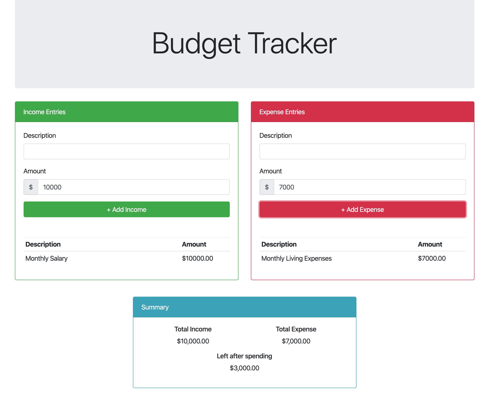

# React200-Budget-Tracker



First project in the React200 course at San Diego Code School teaches you React with Redux archtiecture 
and functionality. App allows you to input total income and expenses to calculate the remaining left.

## Please feel free to demo the project by taking these steps..
```
Clone or fork the repo
```
```
npm install
```
```
npm start
```
```
Open your browser to view on localhost: 3000
```
* **Thank you**, ***-Miles Mickelson***
